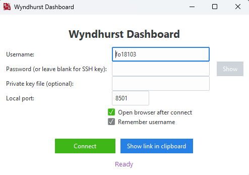
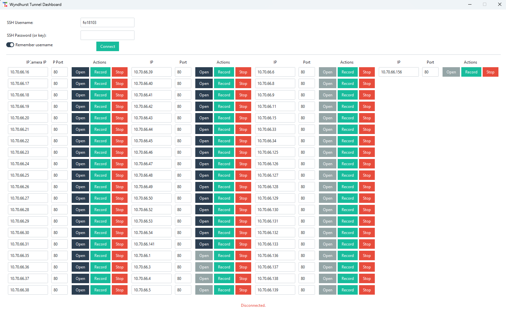

# UoB Wyndhurst Farm Front End

This project provides a simple GUI tool that allows University of Bristol collaborators to open a secure SSH tunnel and access a Streamlit dashboard running on a private UoB server.
The GUI handles the tunneling process automatically and launches the dashboard in the default web browser.

---

## Features

* Secure SSH tunnel creation using UoB credentials
* GUI built with [ttkbootstrap](https://ttkbootstrap.readthedocs.io/en/latest/)
* Automatically opens the Streamlit dashboard at `http://localhost:8501`
* Can be packaged into a single `.exe` file for easy distribution (Windows)

---

## Installation (Development)

### 1. Clone the repository

```bash
git clone https://github.com/biospi/WyndhurstFarmFrontEnd
cd WyndhurstFarmFrontEnd
```

### 2. Create a virtual environment (recommended)

```bash
python -m venv .venv
.\.venv\Scripts\activate   # Windows
source .venv/bin/activate  # macOS/Linux
```

### 3. Install dependencies

```bash
pip install -r requirements.txt
```

### 4. Run the GUI

```bash
python dashboard.py
```

---

## Using the GUI

1. Enter your UoB username (e.g., `ab12345`).
2. Enter your UoB SSH password.
3. Click **Connect**.
4. An SSH tunnel will be created automatically.
5. Your browser will open to:
   **[http://localhost:8501](http://localhost:8501)**
6. (Optional) Click **Disconnect** to close the tunnel.

---

## Building the Executable (Windows)

You can bundle the application into a standalone `.exe` file so collaborators do not need Python installed.

### 1. Install PyInstaller

```bash
pip install pyinstaller
```

### 2. Build the executable

```bash
pyinstaller --onefile --noconsole --icon=uob.ico dashboard.py
```

### 3. Distribute

The generated executable will appear in the `dist/` folder:

```
dist/dashboard.exe
```

Users can simply double-click the file and log in with their UoB credentials.

---

## Prerequisites

* Python **3.9+** (for development)
* OpenSSH client (included in Windows 10+)
* **Access to the UoB network or UoB VPN**

---

## Project Structure

```
.
├── dashboard.py             # Main GUI application
├── requirements.txt         # Python dependencies
├── README.md                # Project documentation
└── uob.ico                  # Optional app icon
```

---

## requirements.txt

```txt
ttkbootstrap
paramiko>=3.0.0
```

---

## GUI Preview

<p align="center">
  
</p>

---

## Direct Camera Access

A separate tool is available for connecting directly to cameras on the network.

1. Connect through the main SSH GUI (enter UoB username and password).
2. Run the camera access script:

```bash
python local_cctv.py
```

The tool will list all cameras detected on the network.
Select the desired camera and click **Open**.

<p align="center">
  
</p>

---

## License

This project is licensed under the GPLv3 License. See the [LICENSE](LICENSE) file for details.